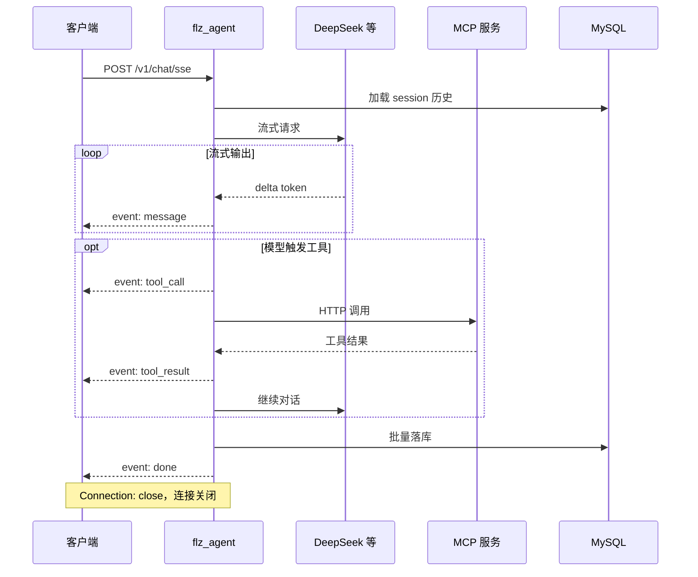

# flz_agent 客户端开发技术文档

> 版本：1.0  
> 更新时间：2026-05-30  
> 适用服务端版本：`flz_agent` 1.0（基于 flz_server 动态模块）

---

## 1. 概述

`flz_agent` 是一款部署在服务器端的 **AI Agent 中间件**。客户端通过 HTTP 与其交互，核心能力为：

- **流式对话**：基于 Server-Sent Events（SSE）实时接收模型输出
- **多轮上下文**：服务端按 `session_id` 自动加载历史消息并裁剪
- **工具调用透传**：MCP 工具调用过程以 `tool_call` / `tool_result` 事件下发（可选展示）
- **多 Agent 类型**：通过 `agent_type` 路由不同工作流（chat / code / draw / mcp）

客户端**不需要**直接对接大模型 API；所有 LLM 调用、上下文管理、工具循环均由服务端完成。

### 1.1 架构关系



### 1.2 当前未提供的接口

| 能力 | 说明 |
| --- | --- |
| 登录 / 注册 | **本服务不提供**。JWT 由外部账号系统签发，客户端携带 Token 即可 |
| WebSocket 聊天 | 当前仅支持 HTTP SSE；WS 端口存在但未注册聊天路由 |
| 会话列表 / 历史查询 REST API | 历史由服务端内部读写；客户端需自行维护 `session_id` 或对接其他业务 API |
| 文件上传 | 请求体为 JSON 文本，不支持 multipart |

---

## 2. 服务地址

默认 HTTP 监听（见 `bin/conf/server.yml`）：

| 地址 | 用途 |
| --- | --- |
| `http://0.0.0.0:8090` | 对外 HTTP |
| `http://127.0.0.1:8091` | 本机 HTTP |

生产环境建议在 Nginx / API 网关后启用 **HTTPS**，客户端 Base URL 示例：

```
https://your-domain.com
```

---

## 3. 接口一览

| 方法 | 路径 | 鉴权 | 说明 |
| --- | --- | --- | --- |
| `GET` | `/v1/health` | 否 | 健康检查 |
| `POST` | `/v1/chat/sse` | 是（可配置关闭） | SSE 流式聊天主入口 |

---

## 4. 鉴权（JWT）

### 4.1 启用条件

由服务端 `bin/conf/jwt.yml` 控制：

- `jwt.enabled: false`（本地调试默认）：无需 Token，服务端以匿名用户 `user_id=0` 处理
- `jwt.enabled: true`（生产推荐）：必须在请求头携带有效 JWT

### 4.2 请求头

支持以下两种方式（按配置 `header_keys` 顺序查找，取第一个非空值）：

```http
Authorization: Bearer <access_token>
```

或

```http
X-Token: <access_token>
```

### 4.3 Token 格式要求

算法：**HS256**

Payload 必须包含的字段（由签发方保证）：

| 字段 | 类型 | 说明 |
| --- | --- | --- |
| `user_id` | number | 用户 ID，用于历史隔离与落库 |
| `role` | string | 角色，默认 `"user"` |
| `iss` | string | 签发者，须与服务端 `jwt.issuer` 一致（默认 `flz_agent`） |
| `exp` | number | 过期时间（Unix 秒） |
| `jti` | string | 可选，Token 唯一 ID（预留黑名单） |

示例 Payload：

```json
{
  "user_id": 10001,
  "role": "user",
  "iss": "flz_agent",
  "iat": 1717000000,
  "exp": 1717007200,
  "jti": "a1b2c3d4-e5f6-7890-abcd-ef1234567890"
}
```

### 4.4 鉴权失败响应

鉴权失败时，服务端仍返回 **HTTP 200** + SSE 流，随后推送 `error` 事件并关闭连接：

```
event: error
data: {"code":401,"msg":"missing token"}

```

常见错误消息：

| msg | 含义 |
| --- | --- |
| `missing token` | 未携带 Token |
| `invalid token` | 签名错误或格式非法 |
| `token expired or claims invalid` | 过期或 `iss` / `nbf` 校验失败 |

---

## 5. 健康检查

### 请求

```http
GET /v1/health HTTP/1.1
Host: 127.0.0.1:8090
```

### 响应

```http
HTTP/1.1 200 OK
Content-Type: application/json; charset=utf-8

{"code":0,"msg":"ok"}
```

可用于启动探活、负载均衡健康检查。

---

## 6. SSE 聊天接口

### 6.1 请求

```http
POST /v1/chat/sse HTTP/1.1
Host: 127.0.0.1:8090
Content-Type: application/json; charset=utf-8
Accept: text/event-stream
Authorization: Bearer <access_token>
Connection: close

{
  "session_id": "chat_9527",
  "msg": "你好，请介绍一下你自己",
  "agent_type": "chat"
}
```

#### 请求体字段

| 字段 | 类型 | 必填 | 默认值 | 说明 |
| --- | --- | --- | --- | --- |
| `session_id` | string | **是** | — | 会话 ID，同一用户下相同 ID 共享上下文 |
| `msg` | string | **是** | — | 用户本轮输入；超长会被服务端截断（默认 8000 字符） |
| `agent_type` | string | 否 | `"chat"` | 工作流类型，见 [§7](#7-agent-类型) |

> **注意**：每次请求对应一次完整对话轮次。服务端在连接关闭前推送全部 SSE 事件；客户端应使用 `Connection: close` 或在收到 `done` / `error` 后主动断开。

### 6.2 响应头

成功时服务端直接写入 SSE 响应头（非标准 JSON 响应）：

```http
HTTP/1.1 200 OK
Content-Type: text/event-stream
Cache-Control: no-cache
Connection: close
```

参数校验失败、鉴权失败等场景同样返回 `200` + SSE `error` 事件（见 [§4.4](#44-鉴权失败响应)）。

### 6.3 SSE 事件协议

SSE 帧格式遵循 [WHATWG SSE 规范](https://html.spec.whatwg.org/multipage/server-sent-events.html)：

```
event: <事件名>
data: <JSON 字符串>

```

每条事件以**空行**（`\n\n`）结束。`data` 字段为单行 JSON（不含换行）。

#### 事件类型总览

| event | 触发时机 | 客户端建议处理 |
| --- | --- | --- |
| `message` | LLM 流式输出 token | 追加到当前回复 UI |
| `tool_call` | 模型决定调用工具 | 可选展示「正在调用 xxx」 |
| `tool_result` | MCP 工具返回结果 | 可选展示工具执行状态 |
| `done` | 本轮请求完成 | 停止 loading，读取 usage |
| `error` | 任意阶段出错 | 展示错误，关闭连接 |

---

### 6.4 各事件 data 结构

#### `message` — 流式文本

```json
{"delta":"你"}
```

- `delta`：本次增量的 UTF-8 文本片段
- 客户端需将所有 `message` 事件的 `delta` **顺序拼接**得到完整回复

#### `tool_call` — 工具调用（观测用）

```json
{
  "name": "turn_on_light",
  "args": {"room": "客厅"}
}
```

#### `tool_result` — 工具结果（观测用）

成功示例：

```json
{
  "name": "turn_on_light",
  "service": "home_assistant",
  "endpoint": "http://127.0.0.1:8800/mcp",
  "status": 200,
  "ok": true,
  "data": {"result": "light on"}
}
```

失败示例：

```json
{
  "name": "unknown_tool",
  "ok": false,
  "error": "tool not found"
}
```

#### `done` — 请求完成

```json
{
  "finish_reason": "stop",
  "usage": {
    "prompt_tokens": 128,
    "completion_tokens": 56,
    "total_tokens": 184
  }
}
```

| 字段 | 说明 |
| --- | --- |
| `finish_reason` | 结束原因，常见值 `stop`；工具循环超限等场景可能为其他值 |
| `usage.prompt_tokens` | 本轮累计 prompt token（含多轮 LLM 调用） |
| `usage.completion_tokens` | 本轮累计 completion token |
| `usage.total_tokens` | 合计 |

收到 `done` 后，连接即将关闭，**不应再发送数据**。

#### `error` — 错误

```json
{"code":400,"msg":"session_id or msg is empty"}
```

| code | 典型 msg | 场景 |
| --- | --- | --- |
| 400 | `invalid request body` | JSON 解析失败 |
| 400 | `session_id or msg is empty` | 缺少必填字段 |
| 401 | 见 [§4.4](#44-鉴权失败响应) | 鉴权失败 |
| 500 | `workflow not found` | 未知 agent_type 且无 chat 回退 |
| 500 | `workflow failed` | LLM / DB / 工具循环内部错误 |

---

## 7. Agent 类型

通过请求体 `agent_type` 选择工作流：

| agent_type | 说明 | 当前行为 |
| --- | --- | --- |
| `chat` | 通用对话（默认） | 完整 LLM + MCP 工具循环 |
| `code` | 代码助手 | 在用户消息前加 `[code]` 前缀后走 chat 流程 |
| `draw` | 绘图助手 | 在用户消息前加 `[draw]` 前缀后走 chat 流程 |
| `mcp` | MCP 优先场景 | 在用户消息前加 `[mcp]` 前缀后走 chat 流程 |

未知类型会**回退到 `chat` 工作流**；若 chat 也未注册则返回 500。

---

## 8. 会话与上下文

### 8.1 session_id 规则

- 由**客户端生成并维护**（建议 UUID 或 `chat_<timestamp>`）
- 同一 `user_id` + 相同 `session_id` 的请求共享对话历史
- 不同 `user_id` 即使 session_id 相同也**不会**串话（服务端强制 `user_id AND session_id` 双条件查询）

### 8.2 上下文裁剪（服务端行为）

客户端无需传递历史消息；服务端自动：

1. 从 MySQL 加载最近 N 条记录（N = `max_rounds * 2`，默认 20 条）
2. 按 `max_rounds`（默认 10 轮）裁剪
3. 将本轮 user / assistant / tool 消息批量落库

客户端只需保证 **同一对话使用固定 session_id** 即可实现多轮连续对话。

### 8.3 并发限制

同一 session 的并发请求可能导致上下文错乱。客户端应：

- 同一 `session_id` **串行**发送请求（上一条 `done` 后再发下一条）
- 或不同对话使用不同 `session_id`

---

## 9. 客户端实现指南

### 9.1 推荐交互流程

```
1. （可选）GET /v1/health 确认服务可用
2. 生成或读取本地 session_id
3. POST /v1/chat/sse，Accept: text/event-stream
4. 逐行读取响应体，解析 SSE 帧
5. 收到 message → 拼接 delta 更新 UI
6. 收到 done → 结束 loading，保存 usage（可选）
7. 收到 error → 展示错误
8. 关闭连接
```

### 9.2 curl 示例

```bash
# 健康检查
curl -s http://127.0.0.1:8090/v1/health

# SSE 聊天（jwt.enabled=false）
curl -s -N -X POST http://127.0.0.1:8090/v1/chat/sse \
  -H 'Content-Type: application/json' \
  -H 'Accept: text/event-stream' \
  -d '{"session_id":"chat_9527","msg":"你好","agent_type":"chat"}'

# SSE 聊天（带 JWT）
curl -s -N -X POST http://127.0.0.1:8090/v1/chat/sse \
  -H 'Authorization: Bearer <access_token>' \
  -H 'Content-Type: application/json' \
  -H 'Accept: text/event-stream' \
  -d '{"session_id":"chat_9527","msg":"继续上一个话题"}'
```

> `-N`（no-buffer）对 curl 实时显示 SSE 很重要。

### 9.3 JavaScript（Fetch + ReadableStream）

```javascript
async function chatSSE({ baseUrl, token, sessionId, message, agentType = 'chat', onDelta, onEvent }) {
  const headers = {
    'Content-Type': 'application/json',
    'Accept': 'text/event-stream',
  };
  if (token) {
    headers['Authorization'] = `Bearer ${token}`;
  }

  const resp = await fetch(`${baseUrl}/v1/chat/sse`, {
    method: 'POST',
    headers,
    body: JSON.stringify({
      session_id: sessionId,
      msg: message,
      agent_type: agentType,
    }),
  });

  if (!resp.ok && resp.status !== 200) {
    throw new Error(`HTTP ${resp.status}`);
  }

  const reader = resp.body.getReader();
  const decoder = new TextDecoder('utf-8');
  let buffer = '';
  let currentEvent = 'message';
  let dataLines = [];

  const flush = () => {
    if (dataLines.length === 0) return;
    const data = dataLines.join('\n');
    dataLines = [];
    let payload;
    try {
      payload = JSON.parse(data);
    } catch {
      payload = data;
    }
    onEvent?.(currentEvent, payload);
    if (currentEvent === 'message' && payload.delta) {
      onDelta?.(payload.delta);
    }
    if (currentEvent === 'done' || currentEvent === 'error') {
      reader.cancel();
    }
  };

  while (true) {
    const { done, value } = await reader.read();
    if (done) {
      flush();
      break;
    }
    buffer += decoder.decode(value, { stream: true });

    let idx;
    while ((idx = buffer.indexOf('\n')) !== -1) {
      let line = buffer.slice(0, idx);
      buffer = buffer.slice(idx + 1);
      if (line.endsWith('\r')) line = line.slice(0, -1);

      if (line === '') {
        flush();
        continue;
      }
      if (line.startsWith('event:')) {
        currentEvent = line.slice(6).trim();
      } else if (line.startsWith('data:')) {
        dataLines.push(line.slice(5).trim());
      }
      // 忽略注释行（心跳）: line.startsWith(':')
    }
  }
}

// 使用示例
let fullText = '';
await chatSSE({
  baseUrl: 'http://127.0.0.1:8090',
  sessionId: 'chat_web_001',
  message: '你好',
  onDelta: (d) => { fullText += d; console.log(fullText); },
  onEvent: (evt, data) => console.log('[event]', evt, data),
});
```

### 9.4 Python（requests 流式）

```python
import json
import requests

def chat_sse(base_url, session_id, msg, token=None, agent_type="chat"):
    headers = {
        "Content-Type": "application/json",
        "Accept": "text/event-stream",
    }
    if token:
        headers["Authorization"] = f"Bearer {token}"

    body = {
        "session_id": session_id,
        "msg": msg,
        "agent_type": agent_type,
    }

    with requests.post(
        f"{base_url}/v1/chat/sse",
        headers=headers,
        json=body,
        stream=True,
        timeout=120,
    ) as resp:
        resp.raise_for_status()
        event = "message"
        data_buf = []

        for raw_line in resp.iter_lines(decode_unicode=True):
            if raw_line is None:
                continue
            line = raw_line.strip("\r")

            if line == "":
                if data_buf:
                    payload = json.loads("\n".join(data_buf))
                    yield event, payload
                    data_buf = []
                continue

            if line.startswith("event:"):
                event = line[6:].strip()
            elif line.startswith("data:"):
                data_buf.append(line[5:].strip())

# 使用
for evt, data in chat_sse("http://127.0.0.1:8090", "chat_py_001", "你好"):
    print(evt, data)
    if evt == "message":
        print(data.get("delta", ""), end="", flush=True)
    if evt in ("done", "error"):
        break
```

### 9.5 终端测试工具

项目内置 CLI 可用于联调：

```bash
./bin/agent_chain_cli \
  --url http://127.0.0.1:8090/v1/chat/sse \
  --session chat_cli \
  --agent chat \
  --token <JWT>
```

详见 [TERMINAL_CHAIN_TEST.md](./TERMINAL_CHAIN_TEST.md)。

---

## 10. 客户端开发注意事项

### 10.1 连接模型

- 服务端响应头固定 `Connection: close`
- **一次 HTTP 请求 = 一次完整对话轮次**，不支持在同一连接上发送多条消息
- 多轮对话靠 **相同 session_id 的多次 POST** 实现

### 10.2 SSE 解析

- 按 `\n` 分行，空行表示事件结束
- 同一事件可有多行 `data:`，需用 `\n` 拼接（当前服务端每条事件仅一行 data）
- 忽略以 `:` 开头的注释行（心跳，当前版本未启用但预留）
- 未指定 `event:` 时默认为 `message`

### 10.3 超时

- 服务端默认请求超时约 120s（`agent.invocation.request_timeout_ms`）
- LLM 响应慢或工具链较长时，客户端 HTTP 读超时建议 ≥ **120s**
- 移动端注意后台挂起导致连接中断

### 10.4 错误 HTTP 状态码

SSE 接口在业务错误时通常仍返回 **HTTP 200**，错误信息在 `error` 事件中。不要仅依赖 HTTP 状态码判断成功与否。

### 10.5 Token 刷新

本服务不签发 Token。客户端应在 Token 即将过期前由账号系统刷新，并在 401 类 SSE 错误时引导重新登录。

### 10.6 生产部署建议

| 项 | 建议 |
| --- | --- |
| 传输 | HTTPS（TLS 终结于网关） |
| 鉴权 | 开启 `jwt.enabled: true` |
| CORS | 浏览器 SPA 需在网关配置 CORS 允许 `Authorization` 头 |
| 限流 | 网关层按 IP / user_id 限流（服务端 M7 尚未内置） |

---

## 11. 完整交互示例

一次带工具调用的典型 SSE 流：

```
event: message
data: {"delta":"好的"}

event: message
data: {"delta":"，我来帮你开灯"}

event: tool_call
data: {"name":"turn_on_light","args":{"room":"客厅"}}

event: tool_result
data: {"name":"turn_on_light","ok":true,"status":200,"data":{"result":"ok"}}

event: message
data: {"delta":"，灯已打开。"}

event: done
data: {"finish_reason":"stop","usage":{"prompt_tokens":210,"completion_tokens":45,"total_tokens":255}}

```

---

## 12. 常见问题（FAQ）

**Q：为什么收到 HTTP 200 但内容是 error 事件？**  
A：SSE 接口设计为始终建立 SSE 流，业务错误通过 `event: error` 传递，便于统一客户端解析逻辑。

**Q：能否在一个连接里连续发多条消息？**  
A：不能。请使用相同 `session_id` 发起多次 POST。

**Q：客户端需要传历史消息吗？**  
A：不需要。传 `session_id` 即可，服务端自动加载。

**Q：anonymous 模式（jwt.enabled=false）下历史会混淆吗？**  
A：所有匿名请求 `user_id=0`，相同 session_id 会共享历史。生产环境务必开启 JWT。

**Q：tool_call 事件必须展示吗？**  
A：否。仅供调试或高级 UI；普通聊天界面可只处理 `message` 和 `done`。

**Q：是否支持 stream:false 一次性返回？**  
A：当前仅支持 SSE 流式；无同步 JSON 聊天接口。

---

## 13. 相关文档

| 文档 | 说明 |
| --- | --- |
| [design_plan.md](../design_plan.md) | 服务端完整设计方案 |
| [PROJECT_STATUS.md](./PROJECT_STATUS.md) | 项目进度与里程碑 |
| [TERMINAL_CHAIN_TEST.md](./TERMINAL_CHAIN_TEST.md) | 终端联调步骤 |
| [flz_server_issues.md](./flz_server_issues.md) | SSE 与 HTTP 框架兼容说明 |

---

## 附录 A：TypeScript 类型定义

```typescript
/** POST /v1/chat/sse 请求体 */
interface ChatSseRequest {
  session_id: string;
  msg: string;
  agent_type?: 'chat' | 'code' | 'draw' | 'mcp';
}

/** event: message */
interface SseMessageData {
  delta: string;
}

/** event: tool_call */
interface SseToolCallData {
  name: string;
  args: Record<string, unknown>;
}

/** event: tool_result */
interface SseToolResultData {
  name: string;
  ok: boolean;
  error?: string;
  service?: string;
  endpoint?: string;
  status?: number;
  data?: unknown;
}

/** event: done */
interface SseDoneData {
  finish_reason: string;
  usage: {
    prompt_tokens: number;
    completion_tokens: number;
    total_tokens: number;
  };
}

/** event: error */
interface SseErrorData {
  code: number;
  msg: string;
}

/** GET /v1/health 响应 */
interface HealthResponse {
  code: 0;
  msg: 'ok';
}

type SseEventName = 'message' | 'tool_call' | 'tool_result' | 'done' | 'error';

type SseEventPayload =
  | SseMessageData
  | SseToolCallData
  | SseToolResultData
  | SseDoneData
  | SseErrorData;
```

---

*文档结束*
