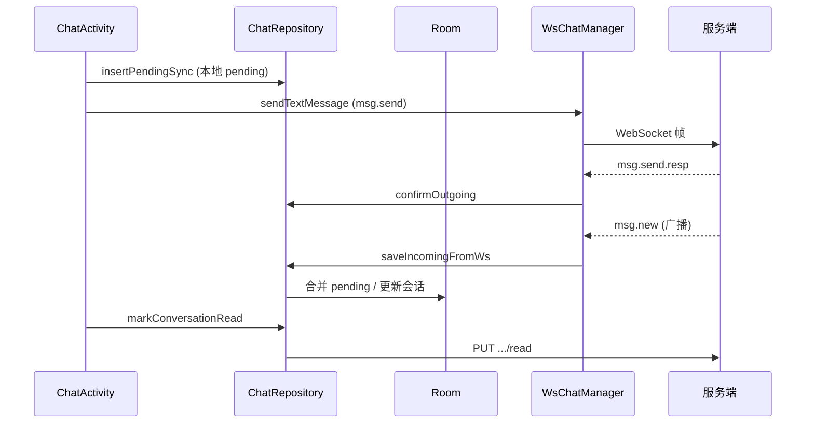

# flz_chat Android 项目开发使用手册

> 本文档面向参与 **flz_chat** Android 客户端开发的工程师，说明整体架构、模块划分、数据流与各源文件职责。  
> 后端 HTTP / WebSocket 协议细节见同目录 `CLIENT_DEVELOPMENT_GUIDE.md`、`CLIENT_API_CHAT.md`、`CLIENT_API_AGENT.md`。

---

## 1. 项目概述

**flz_chat** 是一款即时通讯 + 社交 + AI 智能体的 Android 客户端，采用 **Java + 传统 View 体系**（非 Compose），通过 **Retrofit** 访问业务 HTTP 服务，通过 **OkHttp WebSocket** 接入 Chat 长连接，使用 **Room** 做离线缓存。

| 能力 | 传输方式 | 说明 |
|------|----------|------|
| 登录 / 注册 / 资料 | HTTP | `AuthRepository` / `UserRepository` |
| 会话列表 / 历史消息 / 已读 | HTTP + Room | `ChatRepository` |
| 纯文本实时收发 | WebSocket | `WsChatManager` → `msg.send` / `msg.new` |
| 图片等媒体消息 | HTTP 上传 + `POST /api/messages` | `FileRepository` + `ChatRepository.sendImageMessage` |
| 好友 / 好友申请 | HTTP + Room | `FriendRepository` |
| 社交动态 | HTTP + Room | `SocialRepository` |
| AI 智能体对话 | HTTP SSE | `AgentRepository` + `AgentSseClient` |

### 1.1 环境要求

- Android Studio（推荐最新稳定版）
- JDK 8+
- `minSdk 28`，`compileSdk 34`
- Gradle 7.x（见 `gradle/wrapper`）

### 1.2 服务地址配置

在 `app/build.gradle` 的 `defaultConfig.buildConfigField` 中修改：

| 字段 | 含义 |
|------|------|
| `BUSINESS_BASE_URL` | 业务 HTTP 基址（默认 `http://192.168.10.24:8087`） |
| `WS_HOST` / `WS_PORT` / `WS_CHAT_PATH` | Chat WebSocket |
| `AGENT_BASE_URL` | 智能体 SSE 服务 |

模拟器访问本机服务可用 `10.0.2.2`；真机调试需改为电脑局域网 IP。应用已开启 `usesCleartextTraffic` 与 `network_security_config.xml` 以支持 HTTP/WS 明文调试。

### 1.3 构建与运行

```bash
# Windows
gradlew.bat assembleDebug
gradlew.bat installDebug
```

启动 Activity：`LoginActivity`（未登录）→ `MainActivity`（已登录）。

---

## 2. 架构设计

### 2.1 分层结构

```
┌─────────────────────────────────────────────────────────┐
│  UI 层 (Activity / Fragment / Adapter)                   │
│  LoginActivity, MainActivity, ChatActivity, ...          │
└───────────────────────────┬─────────────────────────────┘
                            │
┌───────────────────────────▼─────────────────────────────┐
│  Repository 层（业务编排，线程切换，缓存策略）              │
│  ChatRepository, FriendRepository, AgentRepository, ...  │
└───────┬───────────────────────────────┬─────────────────┘
        │                               │
┌───────▼────────┐              ┌───────▼────────┐
│  Room (本地)    │              │  Remote         │
│  AppDatabase   │              │  Retrofit       │
│  *Dao / Entity │              │  WsChatManager  │
└────────────────┘              │  AgentSseClient │
                                └────────────────┘
```

**设计原则：**

- **Repository** 是唯一建议 UI 直接调用的数据入口；不直接在 Activity 里写 SQL 或 Retrofit Call。
- **单例应用上下文**：`FlzChatApp` 持有 `AppDatabase`、`SessionManager`、`WsChatManager`。
- **多账号隔离**：所有 Room 表主键或查询均带 `ownerUserId`（当前登录用户 ID），切换账号会 `clearLocalCacheForOwner`。
- **实时推送**：`WsChatManager.Listener` 由 `MainActivity`、`ChatActivity` 等注册；收到 `msg.new` 后刷新列表与角标。

### 2.2 核心数据流（聊天）



**未读计数规则（客户端）：**

- 仅当 `senderId != 当前用户` 且 `countUnread=true` 时 `incrementUnread`。
- 自己发送的消息：`insertPendingSync` 时 `clearUnread`；`saveIncomingFromWs` 合并回执时同样清零。
- HTTP 同步会话列表时：若 `lastMessage.senderId` 为自己，强制 `unreadCount=0`，避免服务端误计未读覆盖本地已读状态。

### 2.3 导航结构

`MainActivity` 底部五个 Tab（`bottom_nav.xml`）：

| Tab | Fragment / 入口 |
|-----|-----------------|
| 聊天 | `ConversationListFragment` → `ChatActivity` |
| 好友 | `FriendFragment` |
| 智能体 | `AgentListFragment` → `AgentChatActivity` |
| 社交 | `SocialFeedFragment` → `PostSocialActivity` |
| 我 | `ProfileFragment` |

顶部 `wsBanner` 展示 WebSocket 连接/心跳状态。

---

## 3. 目录与文件说明

以下路径均相对于 `app/src/main/`。

### 3.1 应用入口

| 文件 | 功能 |
|------|------|
| `java/com/flz/flz_chat/FlzChatApp.java` | `Application`：初始化 Room、Session、WsChatManager 单例 |
| `AndroidManifest.xml` | 权限、Application、各 Activity 注册与启动模式 |
| `res/xml/network_security_config.xml` | 调试期网络安全配置 |

### 3.2 会话与登录态

| 文件 | 功能 |
|------|------|
| `session/SessionManager.java` | SharedPreferences 存 token、userId、设备 ID、社交「已读时间」等 |
| `ui/AuthGuard.java` | 未登录跳转 `LoginActivity` 的工具方法 |

### 3.3 数据层 — 本地（Room）

| 文件 | 功能 |
|------|------|
| `data/local/AppDatabase.java` | Room 数据库定义（version 5）、多版本 Migration、6 张业务表 |
| `data/local/entity/ConversationEntity.java` | 会话列表缓存行 |
| `data/local/entity/MessageEntity.java` | 聊天消息（含 pending/sent/failed、`clientMsgId`） |
| `data/local/entity/FriendEntity.java` | 好友列表缓存 |
| `data/local/entity/SocialEntity.java` | 社交动态缓存 |
| `data/local/entity/AgentSessionEntity.java` | 智能体会话 |
| `data/local/entity/AgentMessageEntity.java` | 智能体消息（user/assistant/streaming） |
| `data/local/dao/ConversationDao.java` | 会话 CRUD、未读增减、`updateLastMessage` |
| `data/local/dao/MessageDao.java` | 消息查询、发送确认、pending 查找 |
| `data/local/dao/FriendDao.java` | 好友表操作 |
| `data/local/dao/SocialDao.java` | 动态表操作 |
| `data/local/dao/AgentDao.java` | 智能体会话与消息 |

### 3.4 数据层 — 远程

| 文件 | 功能 |
|------|------|
| `data/remote/RetrofitClient.java` | OkHttp + Retrofit 单例，注入 Bearer Token |
| `data/remote/ApiService.java` | 全部 REST 接口声明 |
| `data/remote/WsChatManager.java` | Chat WebSocket：鉴权、心跳、收发消息、事件分发 |
| `data/remote/agent/AgentSseClient.java` | 智能体流式 SSE 请求 |
| `data/remote/dto/ApiResult.java` | 统一响应包装 `code/message/data` |
| `data/remote/dto/AuthDtos.java` | 登录注册相关 DTO |
| `data/remote/dto/ChatDtos.java` | 会话、消息、好友、社交 DTO |
| `data/remote/dto/FileDtos.java` | 上传、发媒体消息响应 |
| `data/remote/dto/UserDtos.java` | 用户资料 DTO |
| `data/remote/dto/PageResult.java` | 分页结构 |

### 3.5 数据层 — Repository

| 文件 | 功能 |
|------|------|
| `data/repository/AuthRepository.java` | 登录、注册、登出、刷新 token |
| `data/repository/UserRepository.java` | 当前用户资料、搜索用户 |
| `data/repository/ChatRepository.java` | 会话同步、消息拉取/落库、发送、已读、未读统计 |
| `data/repository/FileRepository.java` | 聊天/头像等媒体上传 |
| `data/repository/FriendRepository.java` | 好友列表同步、申请、同意、备注 |
| `data/repository/SocialRepository.java` | 动态流同步、发帖、点赞 |
| `data/repository/AgentRepository.java` | 智能体会话列表、发消息、SSE 流式回复落库 |

### 3.6 智能体本地引擎

| 文件 | 功能 |
|------|------|
| `agent/LocalAgentEngine.java` | 可选的本地兜底回复逻辑（无远端时） |

### 3.7 UI — 认证

| 文件 | 功能 |
|------|------|
| `ui/auth/LoginActivity.java` | 登录页，成功后进 MainActivity 并连接 WS |
| `ui/auth/RegisterActivity.java` | 注册页 |
| `res/layout/activity_login.xml` | 登录布局 |
| `res/layout/activity_register.xml` | 注册布局 |

### 3.8 UI — 主框架

| 文件 | 功能 |
|------|------|
| `ui/main/MainActivity.java` | 底部导航、WS 监听、角标（聊天未读/好友申请/社交新帖） |
| `ui/RealtimeRefreshable.java` | Fragment 实时刷新接口 |
| `res/layout/activity_main.xml` | 主界面：WS 条 + Fragment 容器 + BottomNav |
| `res/menu/bottom_nav.xml` | 五个 Tab 菜单项 |
| `res/color/bottom_nav_color.xml` | 导航选中色 |

### 3.9 UI — 聊天

| 文件 | 功能 |
|------|------|
| `ui/chat/ConversationListFragment.java` | 会话列表 Tab，下拉刷新 |
| `ui/chat/ConversationAdapter.java` | 会话列表 RecyclerView 适配器 |
| `ui/chat/ChatActivity.java` | 单聊页：历史消息、WS 发文本、HTTP 发图 |
| `ui/chat/MessageAdapter.java` | 消息气泡（文本/图片、左右布局） |
| `res/layout/fragment_conversation_list.xml` | 会话列表 Fragment 布局 |
| `res/layout/item_conversation.xml` | 单条会话项 |
| `res/layout/activity_chat.xml` | 聊天页布局 |
| `res/layout/item_message.xml` | 单条消息布局 |
| `res/drawable/bg_bubble_self.xml` 等 | 气泡与卡片背景 |

### 3.10 UI — 好友与资料

| 文件 | 功能 |
|------|------|
| `ui/profile/FriendFragment.java` | 好友 Tab |
| `ui/profile/FriendAdapter.java` | 好友列表适配器 |
| `ui/profile/FriendManageActivity.java` | 好友管理、 incoming 申请 |
| `ui/profile/FriendRequestAdapter.java` | 好友申请列表 |
| `ui/profile/FriendDetailActivity.java` | 好友详情、发起单聊 |
| `ui/profile/SearchUserActivity.java` | 搜索用户加好友 |
| `ui/profile/SearchUserAdapter.java` | 搜索结果列表 |
| `ui/profile/ProfileFragment.java` | 「我」Tab：资料入口、登出 |
| `ui/profile/EditProfileActivity.java` | 编辑昵称、头像等 |
| 对应 `res/layout/fragment_friend.xml`、`activity_friend_*.xml` 等 | 布局资源 |

### 3.11 UI — 社交

| 文件 | 功能 |
|------|------|
| `ui/social/SocialFeedFragment.java` | 动态流 Tab |
| `ui/social/SocialAdapter.java` | 动态列表适配器 |
| `ui/social/PostSocialActivity.java` | 发布动态 |
| `res/layout/fragment_social_feed.xml`、`item_social.xml` 等 | 布局 |

### 3.12 UI — 智能体

| 文件 | 功能 |
|------|------|
| `ui/agent/AgentListFragment.java` | 智能体会话列表 Tab |
| `ui/agent/AgentSessionAdapter.java` | 会话列表适配器 |
| `ui/agent/AgentChatActivity.java` | 与智能体对话（流式显示） |
| `ui/agent/AgentMessageAdapter.java` | 消息列表适配器 |
| `res/layout/fragment_agent_list.xml`、`activity_agent_chat.xml` 等 | 布局 |

### 3.13 工具类

| 文件 | 功能 |
|------|------|
| `util/ApiCallback.java` | Retrofit 回调简化（解析 `ApiResult`） |
| `util/TimeUtil.java` | 消息时间字符串解析排序 |
| `util/AvatarHelper.java` | 头像 URL 加载封装 |
| `util/ImageLoader.java` | 通用图片加载（消息图片等） |

### 3.14 资源（res）

| 路径 | 功能 |
|------|------|
| `res/values/strings.xml` | 文案、WS 状态提示 |
| `res/values/colors.xml` | 主题色、未读角标色 |
| `res/values/themes.xml` | Material 主题 |
| `res/values/dimens.xml` | 间距 |
| `res/drawable/ic_nav_*.xml` | 底部导航图标 |
| `res/drawable/bg_*.xml` | 页面渐变、卡片、WS 状态点 |
| `res/mipmap-*` | 应用图标 |

### 3.15 工程根目录

| 文件 | 功能 |
|------|------|
| `settings.gradle` | 模块包含 |
| `build.gradle` | 根构建脚本 |
| `app/build.gradle` | 应用模块依赖与 BuildConfig |
| `gradle.properties` | Gradle 属性 |
| `docs/CLIENT_DEVELOPMENT_GUIDE.md` | 后端 HTTP API 对接说明 |
| `docs/CLIENT_API_CHAT.md` | Chat WS 帧协议 |
| `docs/CLIENT_API_AGENT.md` | Agent API |
| `docs/PROJECT_DEVELOPMENT_MANUAL.md` | 本文档 |
| `docs/V2_AGENT_EXECUTION_MANUAL.md` | Agent 执行/联调手册 |
| `docs/EXECUTION_REPORT.md` | 历史执行记录 |

### 3.16 测试

| 文件 | 功能 |
|------|------|
| `test/.../ExampleUnitTest.java` | 单元测试占位 |
| `androidTest/.../ExampleInstrumentedTest.java` | 仪器测试占位 |

---

## 4. 关键业务流程说明

### 4.1 登录与 WebSocket

1. `LoginActivity` 调用 `AuthRepository.login`。
2. `SessionManager.saveLogin` 持久化 token。
3. `MainActivity.onCreate` 中 `WsChatManager.connectIfLoggedIn()`。
4. 收到 `auth_ok` 后状态为 `AUTHENTICATED`，开始 `ping/pong` 心跳。

### 4.2 发送文本消息

1. `ChatActivity` 生成 `clientMsgId`（UUID）。
2. `ChatRepository.insertPendingSync` 写入 Room（`status=pending`），并 **清除该会话未读**。
3. `WsChatManager.sendTextMessage` 发送 `msg.send`。
4. 服务端 `msg.send.resp` → `confirmOutgoing` 更新 `messageId`。
5. 广播 `msg.new` → `saveIncomingFromWs` 与 pending 合并（按 `clientMsgId` 或最新 pending）。

### 4.3 发送图片消息

1. `insertPendingSyncBlocking`（type=2）。
2. `FileRepository.uploadChatMedia` 上传对象存储。
3. `ChatRepository.sendImageMessage` 走 HTTP `POST /api/messages`。
4. 回调中 `confirmSendWithContent` 更新本地记录。

### 4.4 已读与角标

- 进入 `ChatActivity` 拉取本地消息后，对最大 `messageId` 调用 `markConversationRead`（本地 `clearUnread` + HTTP 已读接口）。
- `MainActivity.refreshNavBadges` 汇总 `ConversationDao.totalUnread` 显示在「聊天」Tab 角标。
- 收到他人消息时 WS 路径 `incrementUnread`；自己发送的路径见 4.2。

### 4.5 登出

- `ProfileFragment` / `AuthRepository.logout` 清除 Session、断开 WS、`ChatRepository.clearLocalCacheForOwner`。

---

## 5. 扩展开发指南

### 5.1 新增 HTTP 接口

1. 在 `ApiService` 增加方法。
2. 在对应 `*Repository` 封装异步与 Room 更新。
3. UI 通过 `ApiCallback` 回调刷新。

### 5.2 新增 WebSocket 事件

1. 在 `WsChatManager.handleFrame` 的 `switch` 增加分支。
2. 需要落库则调用 `ChatRepository` 相应方法。
3. 通过 `Listener.onRealtimeEvent` 或 `onMessageEvent` 通知 UI。

### 5.3 新增 Tab 或页面

1. 新建 Fragment/Activity 与 layout。
2. 在 `AndroidManifest.xml` 注册 Activity。
3. 如需角标，在 `MainActivity.refreshNavBadges` 扩展。

### 5.4 数据库变更

1. `AppDatabase` 的 `version` +1。
2. 新增 `Migration` 并在 `addMigrations` 注册。
3. 更新 Entity / Dao；Repository 同步字段映射。

---

## 6. 常见问题

| 现象 | 可能原因 | 处理 |
|------|----------|------|
| 发送后仍显示未读 | 服务端 `unreadCount` 回写 + 本地未按「自己发送」清零 | 已在本客户端对 self 消息与 sync 做修正；仍异常时查服务端已读接口 |
| WS 一直重连 | `WS_HOST` 不可达或 token 失效 | 检查 BuildConfig、登录态、`wsBanner` |
| 图片发送失败 | 上传接口或 `BUSINESS_BASE_URL` 错误 | 查 `FileRepository` 日志与网络权限 |
| 切换账号数据串号 | `ownerUserId` 未参与查询 | 确认 Dao 条件含 `ownerUserId` |

---

## 7. 版本记录

| 日期 | 说明 |
|------|------|
| 2026-05-31 | 修复发送方未读无法消除；新增本开发手册 |

---

## 8. 相关文档索引

- [CLIENT_DEVELOPMENT_GUIDE.md](./CLIENT_DEVELOPMENT_GUIDE.md) — 业务 HTTP API
- [CLIENT_API_CHAT.md](./CLIENT_API_CHAT.md) — WebSocket 聊天协议
- [CLIENT_API_AGENT.md](./CLIENT_API_AGENT.md) — 智能体接口
- [V2_AGENT_EXECUTION_MANUAL.md](./V2_AGENT_EXECUTION_MANUAL.md) — Agent 联调步骤
